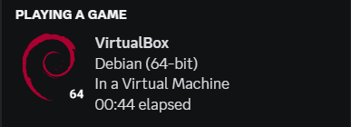

# VirtualBox Rich Presence

[](https://github.com/qwertyquerty/pypresence)

## Screenshot


## Installation 
*(for now only available on windows)*

Download [last release](https://github.com/bukanspot/DiscordBox/releases), instruction for installation include in zip file.


## Develovment
- [Setup](#setup)
- [Config](#config)
- [Available Values](#available-values)
- [Usage](#usage)
- [Compile](#compile)

### Setup
First, clone or download the repository.

```cmd
git clone git@github.com:bukanspot/DiscordBox.git
```

Then go to the [VirtualBox downloads page](https://www.virtualbox.org/wiki/Downloads) and download the VirtualBox SDK.

After downloading it, extract the `VirtualBoxSDK-x.x.x-xxxxxx.zip` file and run the installer.

```cmd
cd installer
```

```cmd
python vboxapisetup.py install
```

Then, install the required modules.

```cmd
cd DiscordBox
```

```cmd
pip install -r requirements.txt
```

### Config

The [config](config.example.ini) allows you to change what is displayed on your rich presence.

### Available Values

- `{machine name}`: Name of the machine in VirtualBox (e.g. "My Windows Machine")
- `{os name}`: Name of OS. (e.g. "Microsoft Windows")
- `{os version name}`: Name of OS version. (e.g. "Windows 8")
- `{os version image}`: Image key of OS version. (e.g. "windows_8")
- `{architecture}`: OS architecture (e.g. "64")
- `{architecture image}`: Image key of OS architecture (e.g. "64")
- `{icon}`: Image key of VirtualBox Icon.

### Usage

Make a copy of [`config.example.ini`](config.example.ini) and remove the `.example`, then [edit it](#config) if you want.

Run `main.py`.

### Compile
For compile to `.exe` use this code
```cmd
pyinstaller.exe --onefile .\main.pyw
```
The `.exe` file found in `dist` directory.

## Note
- The original source has been archived, it's available at [vidhanio/virtualbox-rich-presence](https://github.com/vidhanio/virtualbox-rich-presence)
- File `main.py` is same as `main.pyw`, file `.pyw` just run terminal or cmd in background.
